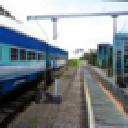

Hcaptcha dataset

RU
Hcaptcha датасет. Данных разных классов (8-ми) порядка ~ 100000. 
Используется для обучения нейросети по разгадыванию hcaptcha.
Автоматическое решение данной капчи находится в соседнем репрозитории.

EN
Hcaptcha dataset. Data of different classes (8) of the order of ~ 100000.
Used to train the neural network to solve hcaptcha.
The automatic solution of this captcha is located in a nearby repository.

airplane

boat

motorbus

motorcycle

seaplane

train

truck
