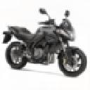

Hcaptcha dataset  

RU  
Hcaptcha датасет. Данных разных классов (8-ми) порядка ~ 100000.   
Используется для обучения нейросети по разгадыванию hcaptcha.  
Автоматическое решение данной капчи находится в соседнем репрозитории.  

unsorted - несортированные картинки навалом ~120000  

Автоматическое решение данного вида капчи  

solve/solve_hcaptcha.py  
Берет случайную капчу из папки 'unsorted' и решает ее  
hcaptcha_65566.jpg  
Captcha = bicycle   

EN  
Hcaptcha dataset. Data of different classes (8) of the order of ~ 100000.  
Used to train the neural network to solve hcaptcha.  
The automatic solution of this captcha is located in a nearby repository.  

unsorted - unsorted pictures in bulk ~120000  

The automatic solution  

solve/solve_math.py  
Takes a random captcha from the 'unsorted' folder and solves it   
hcaptcha_70068.jpg  
Captcha = boat  

airplane

bicycle

boat

motorbus

motorcycle

seaplane

train

truck
